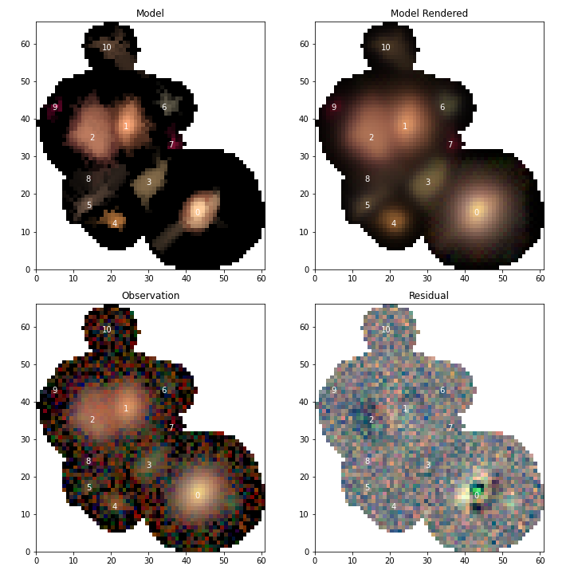

.. _scarlet_models:

================================
Working with scarlet-lite Models
================================

For a given science case it might be desirable/necessary to use the scarlet models themselves (as opposed to the footprints generated in :ref:`reconstruction`).
Presently there is no way to load the data from a single blend (although that functionality will hopefully be an option in the future) so the entire set of models for a catalog must be loaded simultaneously using

.. code-block:: python

    from lsst.daf.butler import Butler
    # Initialize the butler
    butler = Butler("/repo/main", skymap=skymap, collections=collections)
    # Load the deblender output catalog
    catalog = butler.get("deepCoadd_deblendedCatalog", tract=tract, patch=patch)
    # Load the scarlet models for the catalog
    modelData = butler.get("deepCoadd_scarletModelData", tract=tract, patch=patch)

for a given ``skymap``, list of ``collections``, ``tract``, and ``patch``.

.. note::
    Since the scarlet models are multi-band we don't have to specify a band for any of the data products,
    allowing us to regenerate the full multi-band model.

.. note::
    We technically didn't need to load the ``catalog`` here, but it can still be useful to make use of blend information to select blends for investigation.

.. _scarlet_reconstruction:

Reconstructing a blend
----------------------

The blends are stored in the :py:class:`~lsst.meas.extensions.scarlet.io.ScarletModelData` object by source ID.
So, for example, to load the first blend that has 5 children

.. code-block:: python

    import lsst.meas.extensions.scarlet as mes

    # Select the first record with exactly 5 deblended children
    parent = catalog[catalog["deblend_nChild"]== 5][0]
    # Load the PSF for the observation in each band
    observedPsfs = [
        butler.get("deepCoadd_calexp.psf", tract=tract, patch=patch, band=band)
        for band in modelData.bands
    ]

    # Extract the scarlet LiteBlend from the ScarletModelData
    blend = mes.io.multibandDataToScarlet(
        modelData=modelData,
        blendId=parent.getId(),
        observedPsfs=observedPsfs
    )

The result is a :py:class:`~scarlet.lite.LiteBlend` that can be used to generate a model and individually inspect sources and components of sources.
However, because we didn't initialize the model with a :py:class:`~lsst.afw.image.multiband.MultibandExposure`, the
:py:class:`~scarlet.lite.LiteObservation` is replaced with a :py:class:`~lsst.meas.extensions.scarlet.io.DummyObservation` that has no image data or weights.

In order to load the full model, needed in :ref:`scarlet_display` and :ref:`scarlet_restart`, we also have to load an observation.
While we could load the entire exposure in each band, if we're only inspecting a single blend it's faster to only load the portion of the exposure in each band that overlaps with the blend

.. code-block:: python

    from lsst.afw.image import MultibandExposure
    from lsst.geom import Box2I, Point2I, Extent2I
    # Extract the bounding box for the blend
    blendData = modelData.blends[parent.getId()]
    bbox = Box2I(Point2I(*blendData.xy0), Extent2I(*blendData.extent))
    # Load the Exposure in each band
    mExposure = MultibandExposure.fromButler(
        butler,
        modelData.bands,
        "deepCoadd_calexp",
        parameters={"bbox": bbox},
        tract=tract,
        patch=patch
    )

    # Extract the scarlet LiteBlend from the ScarletModelData
    blend = mes.io.multibandDataToScarlet(
        modelData=modelData,
        blendId=parent.getId(),
        mExposure=mExposure,
        footprint=parent.getFootprint()
    )

.. note::
    When using a :py:class:`~lsst.afw.image.multiband.MultibandExposure` it is not necessary to also load the PSF, since the :py:class:`~lsst.afw.image.multiband.MultibandExposure` already contains the PSF model.
    Also note that we included the ``footprint`` parameter, which will mask out all regions in the exposure outside of the parent footprint.
    This is not necessary but ensures that the observation is exactly the same as the one used to generate the scarlet models during deblending.

Finally, if we also want to look at the flux-redistributed results we run

.. code-block:: python

    # Re-dstribute the flux from the image
    scarlet.lite.measure.weight_sources(blend)

This will create the attributes ``flux`` and ``flux_box`` for the flux re-distributed model and box containing the flux re-distributed model respectively.

Inspecting Models
-----------------

.. _scarlet_display:

Displaying a blend
^^^^^^^^^^^^^^^^^^

We can use the standard scarlet display methods to convert the model into an RGB image array and display it in matplotlib

.. code-block:: python

    import scarlet
    import matplotlib.pyplot as plt
    # Use the Lupton RGB sinh^-1 mapping to preserve colors
    norm = scarlet.display.AsinhMapping(minimum=0, stretch=0.1, Q=10)
    # Convolve the model into the observed seeing and discard the narrow-band filter
    model = blend.get_model(convolve=True)[1:]
    # Create a mask to hide the footprint
    mask = ~parent.getFootprint().spans.asArray()
    # Convert the multiband model into 3 RGB colors
    rgb = scarlet.display.img_to_rgb(model, norm=norm, mask=mask)
    # Display the model
    plt.imshow(rgb, origin='lower')
    plt.axis('off')
    plt.show()

Alternatively, if we loaded the multi-band exposure along with our ``blend`` in :ref:`scarlet_reconstruction` then we can use the scarlet display tools to compare the blend to the observations and look at the residual

.. code-block:: python

    import scarlet
    import matplotlib.pyplot as plt
    # Use the Lupton RGB sinh^-1 mapping to preserve colors
    norm = scarlet.display.AsinhMapping(minimum=0, stretch=0.1, Q=10)
    # Hide the narrow-band filter
    channelMap = np.zeros((3, 6))
    channelMap[:, 1:] = scarlet.display.channels_to_rgb(5)
    channelMap

    # Display the scene
    scarlet.lite.display.show_scene(
        blend,
        norm=norm,
        channel_map=channelMap,
        show_model=True,
        show_rendered=True,
        show_observed=True,
        show_residual=True,
        linear=False,
        figsize=(10, 10),
    )
    plt.show()

.. _scarlet_display_sources:

Individual sources
^^^^^^^^^^^^^^^^^^

For deblending it is more important to see how individual sources were modeled.
To view the scarlet models use

.. code-block:: python

    # Only display the first 4 sources
    scarlet.lite.display.show_sources(
        blend,
        sources=blend.sources[:4],
        channel_map=channelMap,
        norm=norm,
        show_model=True,
        show_rendered=True,
        show_observed=True,
        show_spectrum=False,
    )
    plt.show()

Or, if you want to view the flux re-distributed models set ``use_flux=True``

.. code-block:: python

    scarlet.lite.display.show_sources(
        blend,
        sources=blend.sources[:4],
        channel_map=channelMap,
        norm=norm,
        show_model=True,
        show_rendered=True,
        show_observed=True,
        show_spectrum=False,
        use_flux=True,
    )
    plt.show()

.. _scarlet_restart:

Updating a Blend and Warm re-starts
-----------------------------------

Since the science pipelines deblender is a general tool, it's likely to do a poor job on complicated blends where some sources are not detected (eg. the undetected neighbor of source 0), or objects containing more complicated structures (eg. source 2).
In some cases simply adding a missed detection can improve the results for one or more brighter sources so we'll take a look at the easiest way to do that.
To simplify things we won't go into how to determine where to add a new source, we'll just assume that by some method we determined that ``x=52, y=12`` is the location of a new peak in the blend and we'll initialize it using the same method that was used for the other sources with the pipeline was executed.
In addition to initializing and adding the new source to the blend, we also have to parameterize all of the sources.
This is because in *scarlet lite* the model is defined separately from the optimizer, so while we stored the model for each source we still need to initialize an optimizer to generate the best fit.

.. code-block:: python

    # Initialize parameters for a new source
    init = scarlet.lite.Chi2InitParameters(blend.observation, None)
    # Initialize an extra source and add it to the blend
    source = scarlet.lite.init_main_source((12, 52), init)
    blend.sources.append(source)
    # Parameterize all of the sources.
    config = mes.scarletDeblendTask.ScarletDeblendConfig()
    parameterization = partial(
        scarlet.lite.init_adaprox_component,
        bg_thresh=config.backgroundThresh,
        max_prox_iter=config.maxProxIter,
    )
    sources = scarlet.lite.parameterize_sources(blend.sources, blend.observation, parameterization)
    blend = scarlet.lite.LiteBlend(sources, blend.observation)

Now we can fit all of the models, using a higher relative error for convergence to let out model run a bit longer

.. code-block:: python

    # fit the blend
    blend.fit(100, e_rel=1e-4, min_iter=10)
    # Re-dstribute the flux from the image
    scarlet.lite.measure.weight_sources(blend)

and show the model results

.. code-block:: python

    # Display the scene
    scarlet.lite.display.show_scene(
        blend,
        norm=norm,
        channel_map=channelMap,
        show_model=True,
        show_rendered=True,
        show_observed=True,
        show_residual=True,
        linear=False,
        figsize=(10, 10),
    )
    plt.show()

.. image:: images/extraSrcBlend.png

Looking at source 3, and the residual image, we can now see why this source isn't modeled properly by scarlet.
It appears to be a galaxy with many bluer monotonic regions in its disk.
With more detections it would be possible to model each of those sources as a different component and combine them all together into a single source, however it might be better to create a new custom component model that allows for non-monotonic regions using a prior that constrains the SED using the residual image.
This is outside of scope of this document and it is recommended to contact the scarlet authors for advice and assistance in designing such a model.
