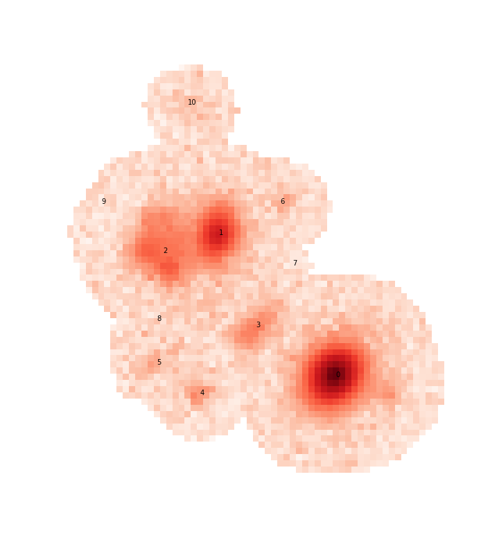
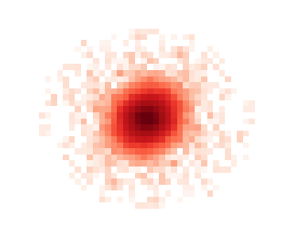

.. _deblending_overview:

===================================
Deblending in the Science Pipelines
===================================

Introduction
------------

There are two different packages that implement deblending in the science pipelines.
Single-band deblending performed during image characterization uses :py:mod:`~lsst.meas.deblender`, which implements an SDSS-like deblender that runs quickly and efficiently.
For more accurate deblending of coadded images the science pipelines use the `meas_extensions_scarlet <https://github.com/lsst/meas_extensions_scarlet>`_ package, which implements the lite version of `scarlet <https://pmelchior.github.io/scarlet/>`_ to iteratively fit a set of source models to a blended image. While a full description of the deblending algorithm is outside the scope of this document, the basic algorithm will be outlined to help the user understand the underlying model.

.. _single-band_deblending:

Single-band Deblending
----------------------

Symmetric Templates
^^^^^^^^^^^^^^^^^^^
The basic algorithm of the single-band deblender relies on the insight that most galaxies roughly exhibit 180° symmetry, which can be exploited to crudely separate sources that are sufficiently separated.
So for each detected peak in a parent footprint, the minimum of each pixel and the pixel on the opposite side of the peak is used to create a symmetric template that will be used to deblend the sources, which is equivalent to::

    symmetric = np.min([image, image[::-1, ::-1]], axis=0)

for a given image ``array``.

For example, let's look at a small blend from the HSC COSMOS dataset:

Or, for now, just the r-band image

This is a good blend to explore because the resulting templates show us a variety of success and failure modes.
Looking first at source 0, which is bright and fairly isolated, the symmetric template is:

Even in this case the template isn't perfect (and isn't intended to be), which we see by looking at the residual of the image with the source 0 template subtracted:

Most of the residual that is part of the actual source is due to the non-symmetric shape of the PSF, however there is also a small blob to the right due to an undetected source that will eventually be falsy included in the flux of this source when we re-apportion the flux in the image (see `re-apportion`_).

Looking at source 2 we see another artifact caused by a complicated galaxy that has multiple non-monotonic regions that either need to be modeled as additional components or a more complex non-monotonic model (see :ref:`scarlet_restart`).

These, and other types of "unrecognized blends" are unavoidable and can be expected in all ground based surveys, including HSC and LSST.

Finally we have source 3, which shows the worst deblending case for a symmetry based deblender: three sources that are nearly aligned and equally spaced

Here, the template for the fainter source in the center picks up flux from both of its neighbors, which will cause it to steal flux from both of them and affect all three models once we re-apportion the flux.
Attempts have been made to use a monotonic projection for templates to mitigate this problem but those tend to cause large fractal-like structures that have been determined to make the templates worse in general, so they are not used in production.

PSF Templates
^^^^^^^^^^^^^

Sources with very low signal to noise (like all sources labeled 5 and greater in the above blend) are unlikely to yield very good symmetric templates because the models are dominated by noise and quickly truncate.
So :py:mod:`~lsst.meas.deblender` attempts to fit the PSF model, including fitting the centroid and a linear background, to all sources.
Any sources with a sufficiently small residual (determined by the task configs ``psfChisq1``, ``psfChisq2``, and ``psfChisq2b``) will use the PSF template in place of the symmetric template.

.. note::
    Unfortunately the PSF model is not good enough to fit bright sources, even if they are perfectly isolated.
    Attempts to fit a PSF model to bright sources leave large residuals in the center that are clearly due to the PSF, and with PIFF the situation is worse. There is also an issue of sufficiently bright sources whose flux extends beyond he size of the PSF, which is ~20 pixels from the center for PSFeX models and 12 pixels from the center for PIFF models.
    So typically the only sources that use the PSF template as a model are the very faintest sources.

.. _re-apportion:

Re-Apportioning Flux
^^^^^^^^^^^^^^^^^^^^

This is where the actual "deblending" takes place.
Once a symmetric or PSF template has been made for each source they are all combined into a single model for the entire blend.
For each source the ratio of its template model to the full model is made, and that ratio is multiplied by the observed image to generate the final model for the source.

.. note::
    In practice it is a bit more complicated than this.
    Accounting for stray flux and flux at the edges of an image also needs to be included,
    but this general outline gives a good overview of the dominant features of the single-band model.

This operation (also called flux-conservation) ensures that all of the flux, including the noise in the image, is contained in one (and only one) source in proportion to the fraction of flux from its template to the full model for each pixel.
Looking at the four brightest sources in the image we see the re-apportioned models below:

This example was chosen because it is a sufficiently complicated blend and one that the single band deblender struggles with.
Most blends have only 2 or 3 faint sources and the single-band deblender does a reasonable job deblending them.
For example, had source 3 been absent from the image

the entire blend would have been modeled better:

.. note::
    Source 3 was subtracted using the model obtained in `multi-band_deblending`_.

But even this model can be improved.
While source 0 is all of the flux in its footprint (since no other model overlaps with it), there is still some mixing between sources 1 and 2.
This is partly due to one or two undetected sources in source 2, but also because symmetric templates alone are not enough to separate objects in a monochromatic image.
A monotonic projection can help, but looking back at the full color image we see that the easiest way for our eyes to separate the sources is by using color information, which will be discussed in the next section.

See `Lupton 2001 <https://www.astro.princeton.edu/~rhl/photomisc/deblender.pdf>`_ for more details on the SDSS implementation of this algorithm.

.. _multi-band_deblending:

Multi-band Deblending with scarlet (lite)
-----------------------------------------

The difference between scarlet and scarlet lite
^^^^^^^^^^^^^^^^^^^^^^^^^^^^^^^^^^^^^^^^^^^^^^^

The science pipelines currently use models generated by the "lite" version of *scarlet*, so it's worth understanding the difference between the two versions.
Algorithmically the two codes are the same, using the same models and even initialization algorithms described later in this section.
The main differences are the underlying architecture and the python modules used to optimize the solution due to differences in intended application.

*scarlet* was designed to be an all-purpose model-fitting deblender for a wide range of instruments, including simultaneous processing.
It can create a joint model from observations of ground based photometry, space based photometry, and even spectral cameras like grisms.
This requires a robust and complicated class hierarchy in order to properly transform data into the proper spectral and spatial pixels of the underlying model, including using a separate package (`autograd <https://github.com/HIPS/autograd>`_) to create gradients used during optimization (see `optimization`_).

*scarlet-lite* was designed specifically for use in the science pipelines and is therefor able to run in a smaller memory footprint in a fraction of the run time of scarlet main.
In this case the data is assumed to be organized as if it was taken from a hyper-spectral camera, meaning the observation in each band is covering the same spatial area, in the same orientation, on the same pixel grid.
This allows for a much simpler class hierarchy and gradients that can be calculated analytically, avoiding the use of an external automatic differentiation package and the memory and runtime overhead that creates.

.. note::
    The *scarlet* developers are currently working on porting from ``autograd`` to either `JAX <https://github.com/google/jax>`_ or `pytorch <https://github.com/pytorch/pytorch>`_.
    In either case, the general performance issues present in ``autograd`` will still be present.

However, the underlying models and algorithms in scarlet and scarlet-lite are *identical*, the only difference between them is the architecture of the code used to generate and optimize the models.
For this reason the remainder of this document will refer to the multi-band deblending algorithm as *scarlet*, even though in practice the actual package implementing the algorithm is *scarlet lite*.

.. _basic_scarlet_model:

Basic Model
^^^^^^^^^^^

Just like the single-band deblender, in order to make a model for a multi-band image we will have to make some assumptions.
In this case the main assumption is that an astrophysical source can be modeled as a collection of components, where each component can be described by a single spectrum (which we call an SED, technically abusing the term) that is roughly constant but can vary in magnitude over its spatial extent (morphology).
This assumption can be justified physically by considering the structure of a galaxy.
In general the populations of stars in the bulge and disk are different, as well as perhaps additional populations of star forming regions, each with its own distinct SED.
However, the range of colors within each population is not that large (e.g. star-forming regions are blue, and bulges tend to be red), which is why parametric bulge-disk models (Sersic models, Spergel models, Gaussian mixture models, etc.) have been successfully used in deblending and photometric measurement.

The other assumption that is currently made in the science pipelines models is that each component is monotonically decreasing from a peak.
Again, thinking of galactic structure this is usually a reasonable assumption as both the bulge and disk are brightest in the center, and even spiral arms generally emanate from a peak location.
There are exceptions, however, like nebulae and irregular galaxies that are much less organized and not well constrained by a component-like model with a center.

The other main astrophysical effect that is overlooked by these assumptions is extinction by gas and dust, which can cause reddening over a single component.
While it is outside the scope in this tutorial, we have observed reddening residuals in edge-on galaxies and it is currently an active area of research to better model galactic (and intergalactic) dust using *scarlet*.

Because the *scarlet* model is multi-band, and the observations are not required (or recommended) to be matched to a common PSF, the model itself must exist in a space that can be convolved into the observed seeing in each band, which we will refer to as *model space*.
In order to be sufficiently well sampled we currently use a PSF for the model space that is a circular Gaussian with ``σ=0.8`` pixels, ensuring that our model image is well-sampled but smaller than the observed PSF in each observed band.

.. note::
    It is possible that a single visit may have an under-sampled PSF, in which case one can expect artifacts and erratic behavior from the *scarlet* models.
    This problem is not isolated to the deblender, as under-sampled PSFs cause problems in many other places further upstream and will cause much larger issues than the deblender results.
    However, there are currently no plans to use *scarlet* on single visits and it is expected that co-adds will always be well-sampled.

.. _model_init:

Initialization
^^^^^^^^^^^^^^

One way to think of the initial *scarlet* models is that they are basically the same as the templates generated by the single band deblender (see `single-band_deblending`_) with one key difference: because the *scarlet* models are obtained using an iterative optimization procedure, using the assumption of monotonicity from the peak location is a well-defined and useful (perhaps necessary) constraint.

For *scarlet* we have chosen the *𝛘²* (inverse variance-weighted or Kaiser) co-add to initialize our morphologies (this essentially means that we divide each image by its variance and sum the result across bands to give a weighted monochromatic image to use for detection).
While this is not a truly accurate model (since each observation uses a different seeing), it gives us a fast and efficient method for generating a detection image.
The main downfall of this choice is that our model space has a much narrower seeing than the detection image, meaning our initial models will always be "puffy."
We have tried numerous deconvolution and approximation methods but so far we have not found any method that provides enough of an improvement to overcome the runtime required to generate the detection image.
In other words, every method that we have come up with to generate a better detection image is more expensive computationally than just running the scarlet optimizer for a few extra iterations to converge to the same solution.

Once we have fit the morphology for each component of each source, we use a linear least-squares algorithm to simultaneously fit the SED of each source *in scarlet model space*.
Because we normalize the morphology, including the intensity information in the SED, this is different than the observed SED, as the PSF in each band will distribute the model flux differently.
In this case the computational savings of the least-squares SED fit *is* significant enough to justify its use.

.. note::
    For *very* large (approx *1k* × *1k* pixel) blends the least squares fit runs into memory issues, since the size of the array to fit is roughly ``number of sources × number of bands × width × height)``.
    In that case setting :attr:`~lsst.meas.extensions.scarlet.ScarletDeblendConfig.setSpectra` to ``False`` is recommended.

.. note::
    An interesting fact about optimization in scarlet is that the best initialization (in terms of 𝛘²) will not necessarily result in the fastest runtime or even the most optimal fit.
    The interplay between the particular gradient descent method used and proximal operators is complicated and often certain irregularities (like sources with slightly worse positions) can result in improved optimization in terms of both runtime and log-likelihood.

.. _optimization:

Optimization
^^^^^^^^^^^^

In addition to being multi-band, the other main difference between *scarlet* and the single-band deblender is that the *scarlet* models are iteratively optimized using a gradient-descent-like algorithm.
The extra time to run this optimizer is the primary reason that *scarlet* is not used on the single-visit exposures.
We have tested a number of different algorithms over the years and so far we have achieved the best performance using proximal ADAM, as described in `Melchior et al. 2019 <https://arxiv.org/abs/1910.10094>`_.

For example, the blend above can be fit in 11 iterations to get the following results, using the *scarlet* models to re-apportion the flux from the observation in each band:

.. image:: images/scarletModel1.png

While much improved, the models still aren't perfect.
Notice that the *scarlet* model for source 0 has stray flux to the upper left and lower right that (fortunately) doesn't matter in the flux re-apportioned model, however sources 1 and 2 have their flux slightly truncated due the the presence of their neighbor in both the *scarlet* models and flux re-apportioned models.
This is an artifact of the particular optimizer chosen and (potentially) the interplay between the optmizer and a truncated and inexact PSF model.
We are still in the process of testing optimizers to find the one best suited for photometric data.

In :ref:`catalog_deblending` we'll look at how to execute scarlet on a full catalog and in :ref:`scarlet_models` we'll look at how to work with the *scarlet* lite data products produced by :func:`~lsst.meas.extensions.scarlet.deblend_lite`.

Further Reading
^^^^^^^^^^^^^^^

See the full *scarlet* `documentation <https://pmelchior.github.io/scarlet/1-concepts.html>`_ for a more thorough description of the model, including the method for applying constraints and optimization parameters.
